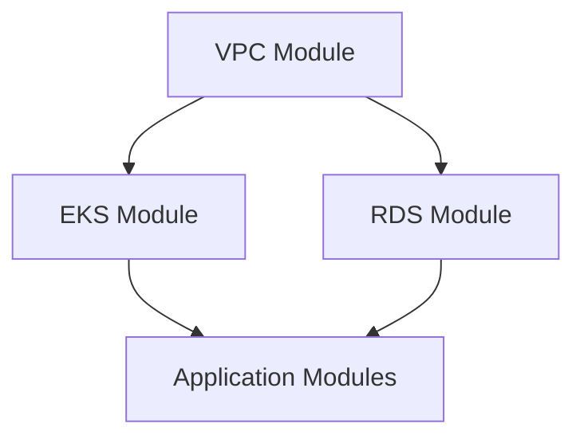

# Terraform Configuration Documentation

This directory contains Terraform modules and configurations for the Kargo ArgoCD infrastructure.

## 🏗️ Module Architecture

**Terraform Structure:**
- **Modular Design**: Each AWS service in its own module directory
- **Environment Separation**: Environment-specific tfvars files within modules
- **Shared Patterns**: Common patterns using CloudPosse modules
- **Version Pinning**: All modules use pinned versions for stability

## 📁 Module Organization

```
terraform/
├── vpc/                    # VPC networking infrastructure
│   ├── env/               # Environment configurations
│   │   ├── dev.tfvars    # Development settings
│   │   └── stg.tfvars    # Staging settings
│   ├── main.tf            # VPC module configuration
│   ├── variables.tf       # Input variables
│   ├── outputs.tf         # Output values
│   ├── versions.tf        # Provider and module versions
│   └── CLAUDE.md          # VPC-specific documentation
├── eks/                   # Kubernetes cluster (future)
├── rds/                   # Database infrastructure (future)
└── CLAUDE.md              # This file - Terraform conventions
```

## 🔧 Terraform Conventions

### File Structure Standard
Each module follows consistent file organization:

```hcl
# main.tf - Primary resource definitions
provider "aws" {
  region = var.aws_region
  default_tags {
    tags = local.common_tags
  }
}

# variables.tf - All input variables with validation
variable "environment" {
  description = "Environment name"
  type        = string
  validation {
    condition     = contains(["dev", "stg", "prd"], var.environment)
    error_message = "Environment must be dev, stg, or prd."
  }
}

# outputs.tf - All module outputs with descriptions
output "vpc_id" {
  description = "ID of the VPC"
  value       = module.vpc.vpc_id
}

# versions.tf - Provider and module version constraints
terraform {
  required_version = ">= 1.5"
  required_providers {
    aws = {
      source  = "hashicorp/aws"
      version = "~> 5.0"
    }
  }
  backend "s3" {
    encrypt = true
  }
}
```

### Variable Naming Conventions

```hcl
# Infrastructure identifiers
var.namespace               # kargo
var.environment            # dev, stg, prd
var.aws_region             # us-east-1
var.project_name           # Kargo ArgoCD Development

# Resource configuration
var.vpc_cidr               # 10.10.0.0/16
var.public_subnet_count    # 1
var.private_subnet_count   # 1

# Feature flags
var.enable_nat_gateway     # true/false
var.enable_ipv6           # true/false

# Environment-specific settings (object type)
var.environment_config = {
  instance_tenancy     = "default"
  enable_vpc_endpoints = false
}
```

### Output Naming Conventions

```hcl
# Resource IDs (for cross-module references)
output "vpc_id"                              # vpc-xxxxx
output "private_subnet_ids"                  # [subnet-xxxxx, ...]
output "kubernetes_cluster_security_group_id" # sg-xxxxx

# Configuration values (for reference)
output "vpc_cidr_block"                      # 10.10.0.0/16
output "cluster_name"                        # kargo-dev-argocd-vpc-useast1

# Cross-module integration
output "eks_cluster_config" {                # Complete config object
  value = {
    vpc_id             = module.vpc.vpc_id
    private_subnet_ids = module.private_subnets.private_subnet_ids
    cluster_name       = local.cluster_name
  }
}

# Remote state references
output "remote_state_key"                    # terraform/vpc/dev/terraform.tfstate
output "remote_state_config"                 # Complete backend config
```

## 🏷️ CloudPosse Integration

### Label Module Pattern
Every module uses CloudPosse label module for consistent naming:

```hcl
module "label" {
  source  = "cloudposse/label/null"
  version = "~> 0.25"

  namespace   = var.namespace      # kargo
  environment = var.environment    # dev
  stage       = var.stage         # development
  name        = var.name          # argocd
  attributes  = var.attributes    # ["vpc"]
  delimiter   = var.delimiter     # -

  tags = var.tags
}

# Generates: kargo-dev-argocd-vpc
# With region: kargo-dev-argocd-vpc-useast1
```

### CloudPosse Module Usage
Standard pattern for using CloudPosse modules:

```hcl
module "vpc" {
  source  = "cloudposse/vpc/aws"
  version = "~> 2.0"

  # Label propagation
  namespace   = module.label.namespace
  environment = module.label.environment
  stage       = module.label.stage
  name        = module.label.name
  attributes  = module.label.attributes
  delimiter   = module.label.delimiter

  # Module-specific configuration
  ipv4_primary_cidr_block = var.vpc_cidr
  dns_hostnames_enabled   = true
  dns_support_enabled     = true
}
```

### Tag Strategy
Consistent tagging across all resources:

```hcl
locals {
  common_tags = merge(
    module.label.tags,
    {
      "kubernetes.io/cluster/${local.cluster_name}" = "shared"
      "Environment"                                  = var.environment
      "Project"                                      = var.project_name
      "ManagedBy"                                    = "terraform"
      "Owner"                                        = var.owner
    }
  )
}
```

## 🔄 State Management

### Backend Configuration
S3 backend with environment-specific state keys:

```hcl
# Partial backend configuration in versions.tf
backend "s3" {
  encrypt = true
  # Bucket, key, and region provided via init -backend-config
}

# Runtime configuration via terraform init
terraform init \
  -backend-config="bucket=github-actions-kargo-argocd" \
  -backend-config="key=terraform/vpc/dev/terraform.tfstate" \
  -backend-config="region=us-east-1"
```

### Cross-Module References
Modules reference each other via remote state:

```hcl
# In EKS module (future)
data "terraform_remote_state" "vpc" {
  backend = "s3"
  config = {
    bucket = "github-actions-kargo-argocd"
    key    = "terraform/vpc/${var.environment}/terraform.tfstate"
    region = var.aws_region
  }
}

# Usage
resource "aws_eks_cluster" "main" {
  name = local.cluster_name

  vpc_config {
    subnet_ids = data.terraform_remote_state.vpc.outputs.private_subnet_ids
  }
}
```

## 📝 Environment Configuration

### Environment-Specific Files
Each module contains environment configuration files:

```bash
# Development configuration
env/dev.tfvars
environment = "dev"
vpc_cidr = "10.10.0.0/16"
public_subnet_count = 1
private_subnet_count = 1
single_nat_gateway = true

# Staging configuration
env/stg.tfvars
environment = "stg"
vpc_cidr = "10.20.0.0/16"
public_subnet_count = 2
private_subnet_count = 2
single_nat_gateway = false
```

### Usage Patterns
```bash
# Plan for specific environment
terraform plan -var-file="env/dev.tfvars"

# Apply with environment variables
terraform apply -var-file="env/stg.tfvars"
```

## ✅ Validation and Testing

### Pre-commit Hooks
Terraform validation runs automatically:

```yaml
# .pre-commit-config.yaml
- id: check-terraform
  name: Check Terraform configuration
  entry: python3 scripts/check_terraform.py
  language: system
  files: ^infrastructure/.*\.tf$
```

### Validation Rules
```hcl
# Variable validation
variable "environment" {
  validation {
    condition     = contains(["dev", "stg", "prd"], var.environment)
    error_message = "Environment must be dev, stg, or prd."
  }
}

variable "public_subnet_count" {
  validation {
    condition     = var.public_subnet_count >= 1 && var.public_subnet_count <= 6
    error_message = "Public subnet count must be between 1 and 6."
  }
}
```

### Testing Strategy
```bash
# Local validation
terraform init
terraform validate
terraform plan -var-file="env/dev.tfvars"

# Automated testing via GitHub Actions
# - terraform validate on all environments
# - terraform plan for changed modules
# - terraform apply on merge to main
```

## 🔐 Security Best Practices

### Provider Configuration
```hcl
# Secure provider defaults
provider "aws" {
  region = var.aws_region

  # Apply common tags to all resources
  default_tags {
    tags = local.common_tags
  }
}
```

### Resource Security
```hcl
# Security group with minimal access
resource "aws_security_group" "kubernetes_cluster" {
  name_prefix = "${module.label.id}-k8s-cluster-"
  vpc_id      = module.vpc.vpc_id

  # Only allow necessary ports
  ingress {
    from_port   = 6443
    to_port     = 6443
    protocol    = "tcp"
    cidr_blocks = [var.vpc_cidr]  # VPC-only access
    description = "Kubernetes API server"
  }

  # Explicit lifecycle management
  lifecycle {
    create_before_destroy = true
  }
}
```

### State Security
```hcl
# Encrypted backend
backend "s3" {
  encrypt = true
  # Bucket encryption enabled separately
}

# No sensitive data in state
output "database_password" {
  sensitive = true
  value     = random_password.db.result
}
```

## 📊 Performance Optimization

### Resource Efficiency
```hcl
# Conditional resources based on environment
resource "aws_vpc_endpoint" "s3" {
  count = var.environment_config.enable_vpc_endpoints ? 1 : 0
  # Only create in staging/production
}

# Right-sizing for environment
locals {
  instance_type = {
    dev = "t3.small"
    stg = "t3.medium"
    prd = "t3.large"
  }
}
```

### Module Optimization
```hcl
# Use data sources for existing resources
data "aws_availability_zones" "available" {
  state = "available"
  filter {
    name   = "opt-in-status"
    values = ["opt-in-not-required"]
  }
}

# Minimize external dependencies
locals {
  cluster_name = "${module.label.id}-${replace(var.aws_region, "-", "")}"
}
```

## 🚀 Deployment Patterns

### Module Dependencies


### Deployment Order
1. **VPC**: Network foundation
2. **EKS**: Kubernetes cluster
3. **RDS**: Database infrastructure
4. **Applications**: Workload deployment

### Rollback Strategy
```bash
# State versioning via S3
aws s3api list-object-versions \
  --bucket github-actions-kargo-argocd \
  --prefix terraform/vpc/dev/terraform.tfstate

# Restore previous state version
aws s3api get-object \
  --bucket github-actions-kargo-argocd \
  --key terraform/vpc/dev/terraform.tfstate \
  --version-id <VERSION_ID> \
  terraform.tfstate.backup
```

## 📚 Module References

- **VPC Module**: [vpc/CLAUDE.md](./vpc/CLAUDE.md)
- **CloudPosse Modules**: [CloudPosse Documentation](https://docs.cloudposse.com/)
- **Terraform Best Practices**: [Terraform Style Guide](https://www.terraform-best-practices.com/)
- **AWS Provider**: [Terraform AWS Provider](https://registry.terraform.io/providers/hashicorp/aws/latest)

## 🔄 Future Modules

### EKS Module (Planned)
```bash
terraform/eks/
├── env/
│   ├── dev.tfvars
│   └── stg.tfvars
├── main.tf              # EKS cluster and node groups
├── variables.tf         # Cluster configuration variables
├── outputs.tf           # Cluster endpoints and references
├── versions.tf          # Kubernetes provider versions
└── CLAUDE.md            # EKS-specific documentation
```

### RDS Module (Planned)
```bash
terraform/rds/
├── env/
│   ├── dev.tfvars
│   └── stg.tfvars
├── main.tf              # RDS instance and subnet groups
├── variables.tf         # Database configuration
├── outputs.tf           # Connection information
├── versions.tf          # Provider requirements
└── CLAUDE.md            # Database documentation
```
